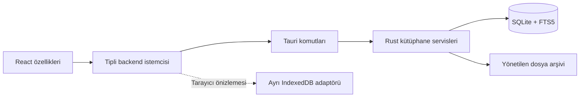

# Teknik tasarım

## Yığın ve sınırlar

Tauri 2 + React 19/TypeScript + Vite; Tailwind ve shadcn tarzı uygulama içi Radix bileşenleri; TanStack Query 5; Zustand 5. Rust servisleri SQLx 0.8.6 ile SQLite/FTS5 kullanır. SQLx 0.8 serisi bilinçli olarak sabitlenir; bağımlılık yükseltmeleri ayrı doğrulanır. PDF.js 6 okuyucu gerektiğinde yüklenir. Fontlar ve PDF worker uygulamaya paketlenir; CDN gerekmez. Uygulama kullanıcı verisini internete göndermez; sunucu ve çalışma zamanı servis maliyeti yoktur.

TanStack Query sorgu ve mutation ayarlarında `networkMode: always` kullanır. Zustand yalnızca gezinme, filtre, seçim ve panel tercihlerini tutar. Metin taslakları ayrı kaydetme kuyruğunda tutulur. React doğrudan SQL çalıştırmaz.

## Veri modeli

Şemanın uygulanabilir kaynağı: `src-tauri/migrations/`. UUID anahtarlar, yabancı anahtarlar, birleşik ilişki anahtarları ve enum CHECK kısıtları bulunur. `items.reading_status` okuma durumunu saklar. `attachments.last_page` dosya başına son PDF sayfasıdır. Dosya formatı kaynağın türünden bağımsızdır. Kategori isimleri aynı üst kategori altında benzersizdir; etiket adları özgün yazımıyla benzersizdir.

SQLite WAL, foreign keys, busy timeout ve paketlenmiş migration kullanır. Yazma servisleri kategori/etiket güncellemeleri ile arama indeksini aynı transaction içinde değiştirir. Liste sorguları sınırlandırılmış sayfalarla çalışır. Kullanıcı metni SQL veya ham FTS dili olarak birleştirilmez. Sıralama alanları enum/izinli listedir.

## Depolama ve içe aktarma

Kök: Tauri `app_local_data_dir()/library`. Veritabanı: `library.sqlite`. Ekler: `files/<attachment-uuid>/original.<extension>`. Geçici alan: `.staging/<job-uuid>`. Veritabanına yalnızca göreli yollar yazılır; özgün dosya adı ayrı tutulur.

İçe aktarma: normal dosya ve uzantı kontrolü → iş kaydı → parçalı kopya ve SHA-256 → aynı hash kontrolü → kalıcı dizine rename → tek DB transaction ile kaynak/ek/ilişki/indeks → iş hazır. Aynı dosya farklı adla gelse de ikinci kopya oluşturulmaz. Başlık benzerliği birleştirme sebebi değildir. İçe aktarma hatası bir sonraki dosyayı engellemez. Tek kaynağa eklenen mükerrer dosya başka kayda aitse mevcut kaynak döndürülür.

Başlangıç toparlanması yalnızca yarım işlere ait staging/kalıcı dosyaları temizler; tamamlanmış ekleri silmez. Dosya ve SQL işlemleri tek atomik işlem gibi kabul edilmez. Dosya yaşam döngüsü işlemleri Rust mutex ile koordine edilir; uygulama tek süreç eklentisini kullanır.

## Belge erişimi

Frontend ek kimliği gönderir. Rust göreli yolun arşiv kökünde kaldığını canonical path ile doğrular. Asset kapsamı sadece `$APPLOCALDATA/library/files/**`. Dosya açma Rust tarafındaki opener üzerinden yapılır; frontend'e genel dosya sistemi veya shell yetkisi verilmez. İçe aktarma PDF, EPUB, TXT, MD, DOC, DOCX, ODT, RTF ve DJVU ile sınırlıdır. HTML/çalıştırılabilir dosyalar açılmaz.

PDF.js bir seferde tek sayfa render eder; zoom, sayfa seçimi, genişliğe sığdırma ve son sayfa geri dönüşü sağlar. Yerel dosya URL'si kullanır; Base64 taşımaz. Range/stream davranışı platform kabul testidir. EPUB ve diğer formatlar varsayılan uygulamada açılır.

## Yedekleme tasarımı

Yedek `.folio` ZIP arşivi: `manifest.json`, tutarlı SQLite snapshot'ı ve göreli dosyalar. Snapshot `VACUUM INTO` ile oluşturulur. Tüm yaşam döngüsü yazmaları yedekleme ile aynı kilidi paylaşır. Hash listesi manifestte saklanır. Hedef dosya tamamlanmadan başarılı sayılmaz; özgün kütüphane üzerine yazılamaz.

Geri yükleme: geçici kökte ZIP yol denetimi, boyut sınırları, şema sürümü, foreign key ve integrity check, tüm SHA-256 doğrulaması; doğrulanmış kütüphane ancak bundan sonra devreye alınabilir. Bu kontroller uygulanmıştır. Onaylanan yedek için kalıcı günlük yazılır; açık SQLite taşınmaz. Uygulama yeniden açılırken önceki kök ayrı klasöre, doğrulanmış kök aktif konuma alınır. İki rename adımı kesintiden sonra tekrar oynatılabilir. Kalıcı çöp için deletion_jobs tablosu dosya temizliğini transaction sonrası ve açılışta tekrarlar. Ayrıntılı kanıt `STATUS.md` içindedir.

## Kaynaklar (12 Eylül 2026 kontrolü)

- [Tauri sistem gereksinimleri](https://v2.tauri.app/start/prerequisites/)
- [Tauri asset kapsamı](https://v2.tauri.app/security/asset-protocol/)
- [Tauri opener](https://v2.tauri.app/plugin/opener/)
- [SQLx 0.8.6](https://docs.rs/sqlx/0.8.6/sqlx/)
- [SQLite FTS5](https://sqlite.org/fts5.html)
- [SQLite tutarlı yedekleme](https://www.sqlite.org/backup.html)
- [TanStack Query ağ modu](https://tanstack.com/query/latest/docs/framework/react/guides/network-mode)
- [PDF.js örnekleri](https://mozilla.github.io/pdf.js/examples/)
